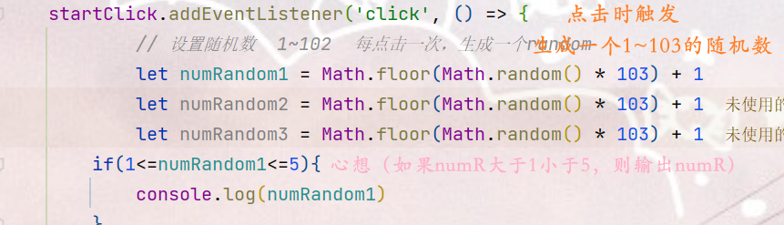

前面用了好多这种格式的if语句，都出现了bug，本以为逻辑很乱导致，于是想一个一个单独拎出来处理。已知百度麻烦还不易找到对口问题，于是我
询问了智能AI，

这一短话让我拨云见日，原来是因为if语句中会参与运算，所以if里面先进行(1<=numR)运算，已知numR必然<=1，所以是true,
而true是布尔值，会被转换成数字1，再与if()里后面的numR<=5进行比较，因为1<=5成立，所以会不停地log(numR)